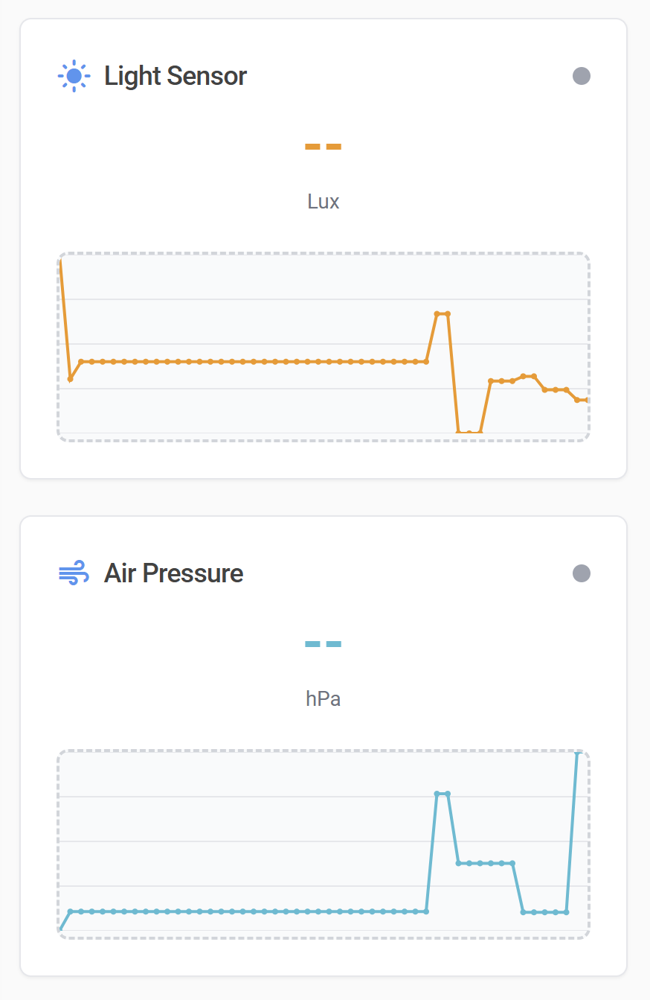

# 🌊 SensorStream

Real-time sensor data collection and monitoring system with React dashboard and Android mobile app.

## 🚀 Features

- **Real-time Sensor Data Collection** from mobile devices and web browsers
- **Interactive Dashboard** with live charts and device monitoring
- **Android Mobile App** for hardware sensor access
- **WebSocket Communication** for low-latency data streaming
- **Multiple Sensor Support**: Accelerometer, Magnetometer, Light, Air Pressure, Orientation
- **Device Management** with connection status and battery monitoring
- **Responsive Design** works on desktop and mobile browsers
- **Error Monitoring** with Sentry integration

## 📸 Screenshots

### Dashboard


## 🎯 Quick Start

### 1. Clone and Setup
```bash
git clone https://github.com/dataontap/SensorStream.git
cd SensorStream
npm install
```

### 2. Start the Application
```bash
npm run dev
```

The application will be available at:
- **Dashboard**: `http://localhost:5000`
- **Device Collection**: `http://localhost:5000/device`

### 3. Connect Devices
- Open `http://localhost:5000/device` on your mobile device
- Tap "Start Sensor Collection" to begin streaming data
- View real-time data on the dashboard at `http://localhost:5000`

## 📱 Android App Setup

### Prerequisites
- Android Studio
- Android device with API level 24+ (Android 7.0)

### Installation
1. Open the `android-app` folder in Android Studio
2. Update the server URL in `MainActivity.kt`:
   ```kotlin
   private val serverUrl = "http://YOUR_SERVER_IP:5000"
   ```
3. Build and install the app on your Android device
4. Grant required permissions when prompted
5. Start sensor collection

## 🛠️ Technology Stack

### Frontend
- **React 18** with TypeScript
- **Tailwind CSS** for styling
- **Radix UI** component library
- **TanStack React Query** for state management
- **Recharts** for data visualization
- **WebSocket (ws)** for real-time communication

### Backend
- **Express.js** web framework
- **WebSocket Server** for real-time data streaming
- **Zod** for data validation
- **Sentry** for error monitoring
- **In-memory storage** with future database support

### Mobile
- **Android Kotlin** with Jetpack Compose
- **Hardware Sensor APIs** for data collection
- **HTTP Client** for server communication

### Development
- **Vite** for fast development and building
- **TypeScript** for type safety
- **ESLint** for code quality

## 📊 Supported Sensors

| Sensor Type | Android App | Web Browser | Units | Description |
|-------------|-------------|-------------|-------|-------------|
| Accelerometer | ✅ | ✅ | m/s² | Linear acceleration including gravity |
| Magnetometer | ✅ | ✅ | μT | Magnetic field strength |
| Light Sensor | ✅ | ✅* | lx | Ambient light level |
| Air Pressure | ✅ | ✅* | hPa | Atmospheric pressure |
| Orientation | ✅ | ✅ | degrees | Device rotation (Alpha, Beta, Gamma) |

*Simulated data for web browsers without native sensor support

## 🔧 Configuration

### Environment Variables
Configure these environment variables (via Replit Secrets or .env file):
```env
SENTRY_KEY=your_sentry_dsn_here
NODE_ENV=production
PORT=5000
```

### Network Setup
- Ensure devices are on the same network as the server
- For Android app, update the server IP address in the code
- Default port is 5000 (configurable)

## 📈 API Documentation

### Device Registration
```http
POST /api/devices
Content-Type: application/json

{
  "id": "unique-device-id",
  "name": "Device Name",
  "userAgent": "Browser/Platform Info"
}
```

### Sensor Data Submission
```http
POST /api/sensor-readings
Content-Type: application/json

{
  "deviceId": "unique-device-id",
  "accelerometer": {"x": 0.12, "y": 9.81, "z": 0.05},
  "magnetometer": {"x": 23.4, "y": -12.1, "z": 45.6},
  "orientation": {"alpha": 0, "beta": 15, "gamma": -5},
  "lightLevel": 150.5,
  "airPressure": 1013.25
}
```

### Get Device List
```http
GET /api/devices
```

### Get Sensor Readings
```http
GET /api/devices/{deviceId}/readings
```

## 🚀 Deployment

### Replit Deployment
1. Click the "Deploy" button in Replit
2. Configure deployment settings
3. Your app will be available at `https://your-app-name.replit.app`

### Manual Deployment
```bash
npm run build
npm start
```

## 🤝 Contributing

1. Fork the repository
2. Create a feature branch (`git checkout -b feature/amazing-feature`)
3. Commit your changes (`git commit -m 'Add amazing feature'`)
4. Push to the branch (`git push origin feature/amazing-feature`)
5. Open a Pull Request

## 📝 License

This project is licensed under the MIT License - see the [LICENSE](LICENSE) file for details.

## 🔗 Links

- **Live Demo**: [SensorStream on Replit](https://sensorstream.replit.app)
- **GitHub Repository**: [https://github.com/dataontap/SensorStream](https://github.com/dataontap/SensorStream)
- **Android APK**: Available in releases

## 🐛 Known Issues

- Light sensor simulation may not reflect actual ambient conditions
- WebSocket reconnection handling in progress
- Battery level reporting not implemented for web devices

## 📧 Support

For questions and support, please open an issue on GitHub or contact the maintainers.
